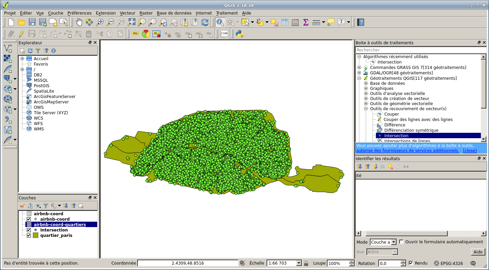
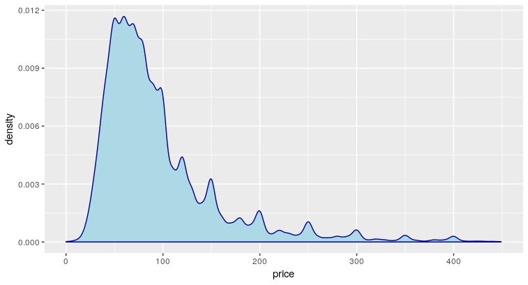
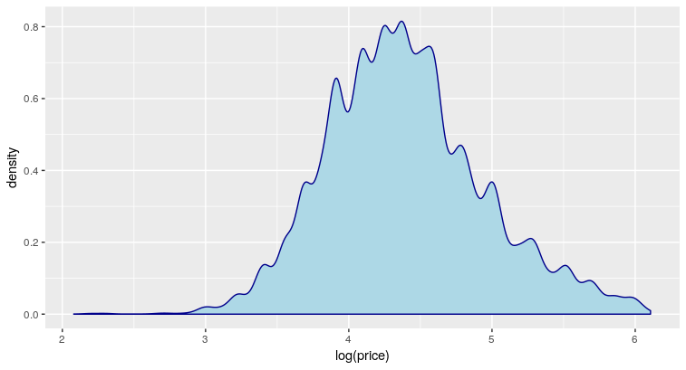
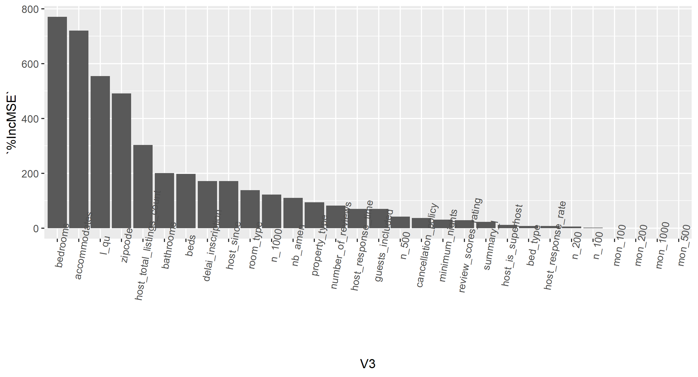
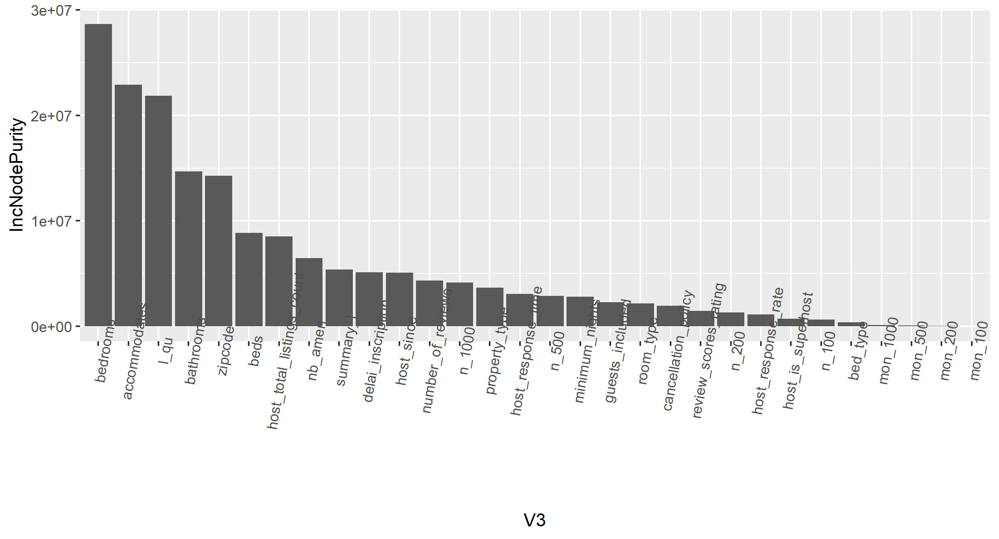

---

# Les données Air BnB

* Le site `http://insideairbnb.com/` propose des fichiers csv à télécharger avec les appartements mis en location sur Air BnB. Nous avons donc récupéré un fichier `listings.csv` contenant environ 60 000 appartements à Paris.

* Nous avons nettoyé ce tableau :
  * Filtrage sur le code postal afin de n'avoir que du 75 ; vérification du code postal afin qu'il n'ait que 5 chiffres
  * Conversions de certaines valeurs avec renommage des champs si nécessaire.
  * Conversion des données de date en date au sens R.
  * Les appartements dont les prix ne sont pas fournis sont supprimés.
  * Le script faisant ce travail est `P00_Projet_desc.R`.

---

# Les monuments de Paris

* Nous nous sommes dit que les locataires étaient peut-être intéressés par une proximité entre leur location et les monuments parisiens.

* Un peu de scrapbooking sur le site http://monumentsdeparis.net/ permet de récupérer les monuments parisiens ainsi que leurs adresses.
* Une seconde étape est d'utiliser l'API REST `adresse.data.gouv.fr` pour récupérer les adresses dans un format harmonisé et les longitudes/latitudes.

* L'étape suivante a été de déterminer pour chaque logement le nombre de monuments à moins de 100m, 200m, 500m et 1km.
* Le script faisant ce travail est `P04_monuments.R`. Le résultat est stocké dans la table `P04_dist_monuments`.

---

# Les gares et stations de métro/RER

* Comme pour les monuments, il est peut-être intéressant pour un locataire de chercher à ce que son logement soit proche de gares.

* Pour en mesurer, une autre source de données est le fichier `accessibilite-des-gares-et-stations-metro-et-rer-ratp.csv` récupéré sur `https://www.data.gouv.fr/en/datasets/accessibilite-des-gares-et-stations-de-metro-et-rer-ratp-1/`.
* Les retraitements de ce fichier consistent en :
  * Ne garder que les adresses du département 75.
  * Supprimer les doublons
  * Séparer la longitude et la latitude en deux colonnes distinctes.

* Et la dernière étape a consisté à déterminer le nombre de stations/gares à moins de 100m, 200m, 500m et 1km.
* Le script faisant ce travail est `P01_ratp.R`. Le résultat est stocké dans la table `P01_dist_RATP`.

---

# Les avis des locataires sur les logements

* Nous avons récupéré un fichier `reviews.csv` sur `http://insideairbnb.com/` contenant les revues des clients (environ 1 000 000 de lignes).
* Nous avons tenté d'en extraire des informations mais la variété des langues a rendu son exploitation assez difficile.
* De plus, notre but étant d'estimer le prix d'une location que l'on aurait à proposer, il nous a semblé difficile d'avoir des revues dès le début.

---

# Fabrication des quartiers

* Nous avons téléchargé les quartiers de Paris sur le site https://opendata.paris.fr/explore/dataset/quartier_paris/export/.
* Nous avons exporté les id, latitudes, longitudes des différentes locations au format csv.

* Ces deux sources ont été importées dans le logiciel QGIS. Son outil d'intersection nous a alors permis de déterminer à quels quartiers appartiennent chacune des locations.
* Après cette opération, nous avons exporté le résultat dans le fichier `quartiers.csv`.

{width=500px}

---

# Premiers modèles

* Une fois toutes nos données regroupées, nous avons commencé par expérimenter quelques modèles :
  * Régression linéaire
  * Régression log linéaire
  * Random Forest avec 500 arbres.

---

# Densité des prix

* Les prix sont à valeurs dans l'intervalle $[0;+\infty[$. Il est probable que la distribution des prix ne suit pas une loi normale...
* Si on trace la densité des prix, on obtient :



---

* Traçons maintenant la densité du $\log$ des prix. On obtient alors :



* Courbe qui ressemble davantage à une gaussienne.
* Plutôt que d'utiliser une régression linéaire pour donner le prix, il semble plus judicieux d'utiliser une régression $\log$ linéaire (régression de Poisson).

---

# Quelques résultats sur ces premiers modèles


```{r functions,echo=F}
tabl <- data.frame(Indicateur = c("Average IB error", "$\\sigma$ IB error (RMSE)", "$R^2_a$", "Average OB error", "$\\sigma$ OB error (RMSE)"),
                   LM=c(0, 43.41, 0.52, 0.51, 36.75), GLM=c(1.35, 32.32, 0.73, 0.68, 44.18),
                   RF=c(0.27, 37.79, 0.64, 0.51, 36.75))
knitr::kable(tabl)
```

---

# Choix des variables

A partir du random forest, nous avons déterminé l'importance des variables avec deux méthodes :

* Mean decrease accuracy
* Mean decrease GINI

On a obtenu les graphiques suivants...

---

# Importance des variables

{width=500px}

{width=500px}

---

# Sélection des variables

Les 9 variables les plus importantes (par croisement des deux) que nous avons choisies :

* bedrooms
* accommodates
* l_qu
* zipcode
* host_total_listings_count
* bathrooms
* delai_inscription
* nb_amen
* summary_l

---

# Régression linéaire avec les 9 variables sélectionnées

* Deux régressions sont faites :
  * Une première avec les dix variables :
    * bedrooms, accommodates, l_qu, zipcode, host_total_listings_count, bathrooms, delai_inscription, nb_amen, summary_l
  * Une seconde avec une application du critère AIC qui a réduit les variables à 8 :
    * bedrooms, accomodates, l_qu, zipcode, host_total_listings_count, bathrooms, nb_amen, summary_l (beds et delai_inscription sont supprimés)

```{r resultLM,echo=F}
tabl <- data.frame(Indicateur = c("Average IB error", "$\\sigma$ IB error (RMSE)", "$R^2_a$", "Average OB error", "$\\sigma$ OB error (RMSE)", "Temps calcul en h"),
                   LM1=c(4.03412137823296e-15, 44.7820916530383, 0.48827020151371, 0.625523131513831, 45.7526415862631, 0.00183849917517768),
                   LM2=c(1.24463403514636e-14, 44.7824626353489, 0.48826172296872, 0.623229361866199, 45.7536758787619, 0.00183849917517768))
knitr::kable(tabl)
```
