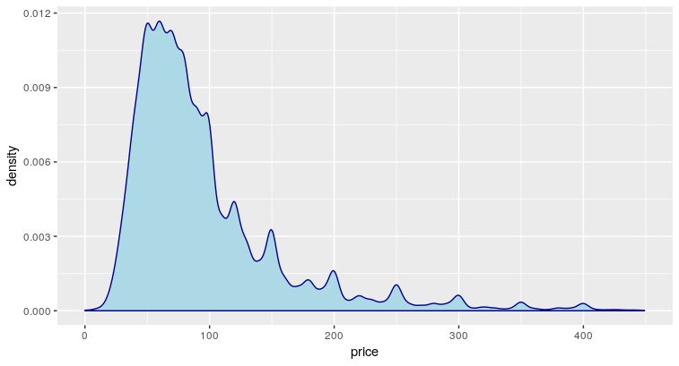
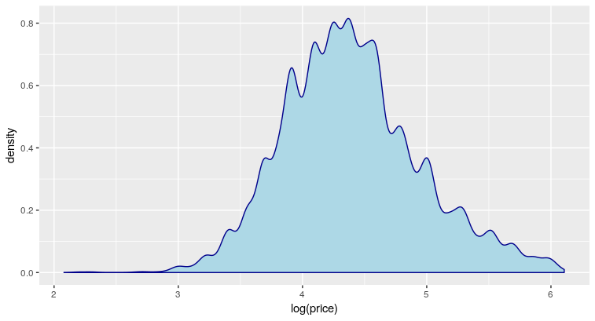

---

# Les données utilisées pour réaliser ce modèle

* Le site `http://insideairbnb.com/` est la base de nos données. On a pu ainsi récupérer le fichier `listings.csv` contenant les appartements mis en location sur Air BNB à Paris (60 000 appartements)

* Nous avons nettoyé ce tableau :
  * Filtrage sur le code postal afin de n'avoir que du 75 ; vérification du code postal afin qu'il n'ait que 5 chiffres
  * Conversions de certaines valeurs avec renommage des champs si nécessaire.
  * Conversion des données de date en date au sens R.
  * Les appartements dont les prix ne sont pas fournis sont supprimés.
  * Ajout d'une colonne avec des intervalles de prix, considérés comme facteurs, ça peut être utile par la suite.

---

* Nous nous sommes aussi procuré la liste des monuments historiques. Cette liste est dans un fichier `merimee-MH-valid.csv`.
* A partir de ces infos, nous avons créé un dataframe _monuments_ dans lequel nous n'avons gardé que les monuments de Paris (département 75).

---

* Une autre source de données est le fichier `accessibilite-des-gares-et-stations-metro-et-rer-ratp.csv` récupéré sur `https://www.data.gouv.fr/en/datasets/accessibilite-des-gares-et-stations-de-metro-et-rer-ratp-1/`.
* Les retraitements de ce fichier consistent en :
  * Ne garder que les adresses du département 75.
  * Supprimer les doublons
  * Séparer la longitude et la latitude en deux colonnes distinctes.
  
---

* Nous avons aussi récupéré le fichier `reviews.csv` contenant les revues des clients (1 000 000 de lignes).
* Nous avons construit les fichiers :
  * `accessibilite-des-gares-et-stations-metro-et-rer.csv` contenant les 400 stations de métro parisiennes avec leurs positions.
  * `quartiers.rds` donnant  Paris et ses 80 quartiers, plus précis que les arrondissements.
  * `Monuments de Paris` à partir de la base Mérimée (2000 données).
* Enfin le site `timeout.fr` peut nous permettre de récupérer les cent meilleurs bars de Paris.


# Fabrication des quartiers

* Nous avons pu télécharger les quartiers de Paris sur le site https://opendata.paris.fr/explore/dataset/quartier_paris/export/.
* Nous avons exporté les id, latitudes, longitudes des différentes locations au format csv.

* Ces deux sources ont été importées dans le logiciel QGIS. Son outil d'intersection nous a alors permis de déterminer à quels quartiers appartiennent chacune des locations.
* Après cette opération, nous avons exporté le résultat dans le fichier `quartiers.csv`.

{width=500px}

---

# Récupération des monuments

Un peu de scrapbooking sur le site http://monumentsdeparis.net/ permet de récupérer les monuments parisiens ainsi que leurs adresses.
Une seconde étape est d'utiliser à nouveau adresse.data.gouv.fr pour récupérer les adresses dans un format harmonisé et les longitudes/latitudes.

Ensuite, pour chaque logement, on compte combien de monuments sont à moins de 100m, 200m, 500m et 1km.
Le script faisant ce travail est `P04_monuments.R`. Le résultat est stocké dans la table `P04_dist_monuments`.

# Premiers essais

## La base Air BnB seule

On a pris quelques champs donnés par la base Air BnB seule, on les a nettoyés puis on a fait une randomforest dessus.

Le bilan est qu'on obtient deux composantes importantes qui sont *la longueur de la présentation de l'appartement* et *l'ancienneté de l'appartement sur Air BnB*
On peut expliquer que le nombre de mots change beaucoup et il y a presque autant de cas que d'appartements présentés, ça peut expliquer un peu la représentativité.
Idem pour le délai d'existence.

On a ensuite fait des tranches de prix que l'on a transformés en factors.
L'erreur est à 80%.

On a regardé la répartition des prix par lieu dans deux cas :

* appartement pour 2 personnes
* tous les appartements

On constate que ce serait sûrement intéressant de faire une classification avant de faire le modèle.


# Pense-bête

* Création d'un property_type plus propre en ajoutant un *Divers*
* Traductions automatiques
* ammenities à nettoyer et regarder ce qu'on peut en tirer
* positivité des messages / commentaires

# Répartition du travail

## Charles

R Shiny : première application avec des onglets

## Mathieu

Web scrapping pour les bars et les monuments.

## David

* Traduction des commentaires
* Analyse des sentiments

```curl -XPOST "https://translate.yandex.net/api/v1.5/tr.json/translate?key=trnsl.1.1.20181214T151349Z.e323c6a0eeb6c59d.6ed57788f95d2a05d4269fddb847986f8769b990&text=ce%20chat%20est%20mignon&lang=fr-en&format=plain"```

fait la traduction de *Ce chat est mignon* en *this cat is cute*.

Problème rencontré : Lors d'une utilisation massive de la fonction `translate` dans une datatable, il arrive un moment où R Studio crashe.
Pour palier à ce problème, j'ai fait un petit programme en Go qui fait le même travail.

## Répartition des prix

Si on trace la densité des prix, on réalise tout d'abord que les prix sont à valeurs dans l'intervalle $[0;+\infty[$ et d'autre part, par rapport à l'intervalle de prix, cette densité a tendance à s'accumuler sur la gauche de l'intervalle.



Il semble donc judicieux de travailler sur le log des prix. Dans ce cas, la densité de $\log(price)$ est beaucoup plus centrée et ressemble davantage à une gaussienne.


